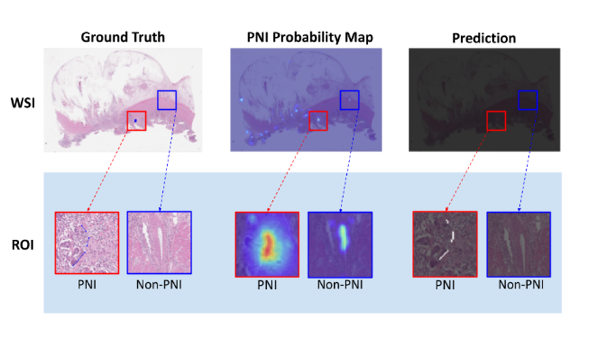

# PAIP 2021 Challenge endorsed MICCAI: Perineural Invasion in Multiple Organ Cancer

3rd place solution to [PAIP 2021 Challenge endorsed MICCAI: Perineural Invasion in Multiple Organ Cancer](https://paip2021.grand-challenge.org/Home/)

[PDF](https://drive.google.com/file/d/16gWjI5cbwn7zI9Rov7oyPETr_fYU101Q/view?usp=sharing) [Article](http://www.hufsnews.co.kr/news/articleView.html?idxno=21998) [Final Rank](https://paip2021.grand-challenge.org/Final-rank/)

In this work, we propose an organ-specific method to detect perineural invasion (PNI) in multiple organ cancer. The proposed method consists of a classification step and a segmentation step. In the classification step, PNI is detected at the patch level using the organ-specifically trained convolutional neural network. In the segmentation step, PNI is finally delineated at the pixel level on the result of the previous step. In particular, the weights pretrained in classification step were utilized in segmentation step. The results show that our method will be helpful for effectively detecting PNI in multiple organ cancer.

Team Members:
**Dayoung Baik, Seungun Jang, Hwanseung Yoo, Gawon Lee, Junhyeok Lee**

  
<b>Figure 3</b> Representative ground truth, PNI probability map and prediction result. PNI region (red) and Non-PNI region (blue).

## 🎯 Aims
---
PAIP 2021 challenge aims to promote the development of a common algorithm for automatic detection of perineural invasion in resected specimens of multi-organ cancers. PAIP 2021 challenge will have a technical impact in the following fields: detection of composite targets (nerve and tumor) and common modeling for target images in multiple backgrounds. This challenge will provide a good opportunity to overcome the limitations of current disease-organ-specific modeling and develop a technological approach to the universality of histology in multiple organs.

## ✔️ Datasets
---

- Data characteristics
Original scanned images in SVS format will be provided for Training, Validation and Test data. The number of datasets are as below.  
  
**Dataset (Colon/Prostate/Pancreas)**

Training Data: 150 WSIs (50/50/50)  
Validation Data: 30 WSIs (10/10/10)  
Test Data: 60 WSIs (20/20/20)  