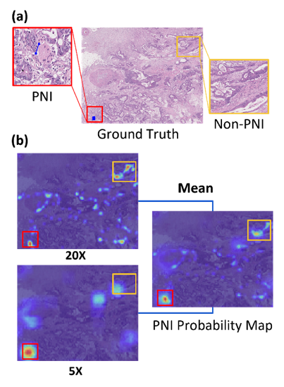
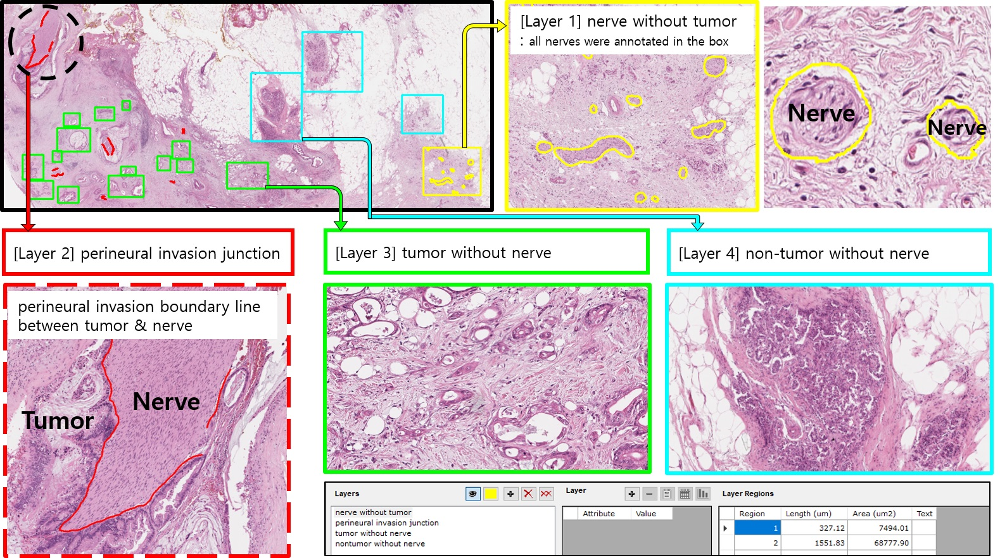

# PAIP 2021 Challenge endorsed MICCAI: Perineural Invasion in Multiple Organ Cancer


3rd place solution to [PAIP 2021 Challenge endorsed MICCAI: Perineural Invasion in Multiple Organ Cancer](https://paip2021.grand-challenge.org/Home/)

[[PDF]](https://drive.google.com/file/d/16gWjI5cbwn7zI9Rov7oyPETr_fYU101Q/view?usp=sharing) [[PPTX]](https://docs.google.com/presentation/d/19LwYwQa4Cpx6oBll6T8KfT2VbQGoM62x/edit?usp=sharing&ouid=100584904410114143200&rtpof=true&sd=true) [[Brochure]](https://drive.google.com/file/d/12ECAQNrT7WPQU6CQzaHFn8mmsN4fNWGk/view) [[Article]](http://www.hufsnews.co.kr/news/articleView.html?idxno=21998) [[Final Rank]](https://paip2021.grand-challenge.org/Final-rank/)

In this work, we propose an organ-specific method to detect perineural invasion (PNI) in multiple organ cancer. The proposed method consists of a classification step and a segmentation step. In the classification step, PNI is detected at the patch level using the organ-specifically trained convolutional neural network. In the segmentation step, PNI is finally delineated at the pixel level on the result of the previous step. In particular, the weights pretrained in classification step were utilized in segmentation step. The results show that our method will be helpful for effectively detecting PNI in multiple organ cancer.

Team Members:  
**Dayoung Baik, Seungun Jang, Hwanseung Yoo, Gawon Lee, Junhyeok Lee**

<p align="center">

<br><br>
<b>Figure 2</b> Two regions of interests with ground truth label (blue pixels) and PNI probability map from our model 
</p>
<p>
</p>  
<p align="center">

<br><br>
<b>Figure 3</b> Representative ground truth, PNI probability map and prediction result. PNI region (red) and Non-PNI region (blue).
</p>


## 🎯 Challenge Aims

PAIP 2021 challenge aims to promote the development of a common algorithm for automatic detection of perineural invasion in resected specimens of multi-organ cancers. PAIP 2021 challenge will have a technical impact in the following fields: detection of composite targets (nerve and tumor) and common modeling for target images in multiple backgrounds. This challenge will provide a good opportunity to overcome the limitations of current disease-organ-specific modeling and develop a technological approach to the universality of histology in multiple organs.


## ✔️ Challenge Datasets


- Data characteristics
Original scanned images in SVS format will be provided for Training, Validation and Test data. The number of datasets are as below.  
  
**Dataset (Colon/Prostate/Pancreas)**

- Training Data: 150 WSIs (50/50/50)  
- Validation Data: 30 WSIs (10/10/10)  
- Test Data: 60 WSIs (20/20/20)  

* Scanned by the Aperio AT2 at 20X magnification
* All whole slide images were stained by hematoxylin and eosin.
* Annotations will be provided for the training set only.
* All cases were randomly selected.
* Test datasets include cases without tumor as well.


<p align="center">

<br><br>
<b>Annotations</b> 
</p>
<p align='center'>
- Layer 1: nerve without tumor (all nerves were annotated in the box)
</p>
<p align='center'>
- Layer 2: perineural invasion junction
</p>
<p align='center'>
- Layer 3: tumor without nerve
</p>
<p align='center'>
- Layer 4: non-tumor without nerve 
</p>
  
## 🚩 Get Started

### Docker build
```bash
cd PAIP2021-Challenge
docker build -t paip2021 .

docker run -d -it --gpus all --shm-size=8G -v <mount path> -v <mound path> --name paip2021 paip2021 bash
docker exec -it paip2021 bash
```

### Make patch
```bash
python make_patch.py --svs_load_dir <WSI directory> --xml_load_dir <annotation directory> --save_dir <patch save directory> --mode random

python make_patch.py --svs_load_dir <WSI directory> --xml_load_dir <annotation directory> --save_dir <patch save directory> --mode sw
```

### Training Encoder & UNet
```bash
python train.py --root_dir <patch save directory> --model_dir <model save directory> --train_mode <clf, seg> --train_type <all, col, pan, pros> ..
```

### Probability Map
```bash
python make_probamap.py --root_dir <WSI directory> --result_dir <model_path & result directory> ...
```

### Final Segmentation Map
```bash
python make_final_result.py --root_dir <WSI directory> --result_dir <model_path & result directory> ..
```

## License
This repository is licensed under the MIT License

## Contact
If you have any questions, feel free to contact Hwanseung Yoo through Email (wazs555@hufs.ac.kr) or Github issues


